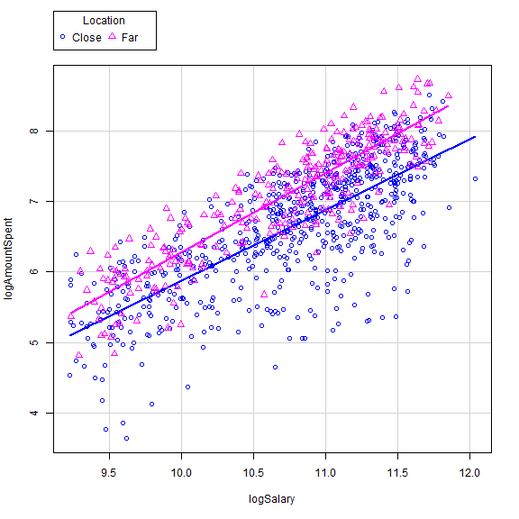

<!-- R Commander Markdown Template -->

BUAD 689 Group 4 R Homework #2
=======================

### Lee Rainwater

### 2020-07-25


{catalog <-
} {read.table("C:/Users/edwar/OneDrive - Texas A&M University/Summer-2020/buad689-pred-analy/hw-r02/Catalogs.csv",
} {header=TRUE, sep=",", na.strings="NA", dec=".", strip.white=TRUE)
}```


{LinearModel.1 <- lm(AmountSpent ~ Children + Salary,
} {data=catalog)
}```


```r
> summary(LinearModel.1)
```

```

Call:
lm(formula = AmountSpent ~ Children + Salary, data = catalog)

Residuals:
    Min      1Q  Median      3Q     Max 
-2445.0  -353.8   -83.0   285.1  3510.1 

Coefficients:
                Estimate   Std. Error t value Pr(>|t|)    
(Intercept)  182.2151276   45.3434938   4.019 0.000063 ***
Children    -235.6224228   19.3269109 -12.191  < 2e-16 ***
Salary         0.0223625    0.0006635  33.704  < 2e-16 ***
---
Signif. codes:  0 '***' 0.001 '**' 0.01 '*' 0.05 '.' 0.1 ' ' 1

Residual standard error: 641.3 on 997 degrees of freedom
Multiple R-squared:  0.5557,	Adjusted R-squared:  0.5548 
F-statistic: 623.4 on 2 and 997 DF,  p-value: < 2.2e-16
```


{LinearModel.1 <- lm(AmountSpent ~ Children + Salary,
} {data=catalog)
}```


```r
> summary(LinearModel.1)
```

```

Call:
lm(formula = AmountSpent ~ Children + Salary, data = catalog)

Residuals:
    Min      1Q  Median      3Q     Max 
-2445.0  -353.8   -83.0   285.1  3510.1 

Coefficients:
                Estimate   Std. Error t value Pr(>|t|)    
(Intercept)  182.2151276   45.3434938   4.019 0.000063 ***
Children    -235.6224228   19.3269109 -12.191  < 2e-16 ***
Salary         0.0223625    0.0006635  33.704  < 2e-16 ***
---
Signif. codes:  0 '***' 0.001 '**' 0.01 '*' 0.05 '.' 0.1 ' ' 1

Residual standard error: 641.3 on 997 degrees of freedom
Multiple R-squared:  0.5557,	Adjusted R-squared:  0.5548 
F-statistic: 623.4 on 2 and 997 DF,  p-value: < 2.2e-16
```
# Observations
Salary shows to be a significant predictor of AmountSpent because the probability of exceeding the t value is less than .05. Salary and number of children do not have the same relation to AmountSpent as evidenced by their very different coefficients.


{catalog$logAmountSpent <-
} {with(catalog, log(AmountSpent))
}```


{catalog$logSalary <-
} {with(catalog, log(Salary))
}```


```r
> scatterplot(logAmountSpent~logSalary | Location, regLine=TRUE, smooth=FALSE,
+    boxplots=FALSE, by.groups=TRUE, data=catalog)
```


# Observations on logAmountSpent vs. logSalary
Performing a log-log transformation eliminates most of the heteroscedasticity in the relationship; however, there still remains some skewness in the distribution about the regression line.
Grouping the data by Location shows that most of the skewness is associated with the Close level of the Location factor.
The slopes of the regression lines for the two levels are nearly, but not quite equal. The intercept for the observations associated with the Far level is slightly above that for the Close level.

# Regression of AmountSpent against History


```r
> LinearModel.History <- lm(AmountSpent ~ History, data=catalog)
> summary(LinearModel.History)
```

```

Call:
lm(formula = AmountSpent ~ History, data = catalog)

Residuals:
    Min      1Q  Median      3Q     Max 
-1621.1  -366.4   -82.1   253.4  4030.9 

Coefficients:
                  Estimate Std. Error t value Pr(>|t|)    
(Intercept)        2186.14      44.28   49.37   <2e-16 ***
History[T.Low]    -1829.05      64.30  -28.45   <2e-16 ***
History[T.Medium] -1235.74      65.72  -18.80   <2e-16 ***
History[T.NEW]     -946.24      60.09  -15.75   <2e-16 ***
---
Signif. codes:  0 '***' 0.001 '**' 0.01 '*' 0.05 '.' 0.1 ' ' 1

Residual standard error: 707.1 on 996 degrees of freedom
Multiple R-squared:  0.4604,	Adjusted R-squared:  0.4588 
F-statistic: 283.2 on 3 and 996 DF,  p-value: < 2.2e-16
```

Regressing AmountSpent against History reveals all three levels of History to be significant predictors. History[T.Low] is the variable representing the Low level of the History factor.
Being a factor of a categorical variable, the sum of the coefficient value of History[T.Low] and the intercept provides the mean value of all observations for which the value of History is Low.

# Regression of AmountSpent against History and Salary, Accounting for Interaction

```r
> LinearModel.2 <- lm(AmountSpent ~ History +Salary +History*Salary, 
+   data=catalog)
> summary(LinearModel.2)
```

```

Call:
lm(formula = AmountSpent ~ History + Salary + History * Salary, 
    data = catalog)

Residuals:
    Min      1Q  Median      3Q     Max 
-2143.3  -254.7   -64.6   206.4  3525.0 

Coefficients:
                            Estimate  Std. Error t value Pr(>|t|)    
(Intercept)               746.357420  138.222710   5.400 8.36e-08 ***
History[T.Low]           -472.268488  151.598345  -3.115 0.001891 ** 
History[T.Medium]          66.249167  177.936031   0.372 0.709734    
History[T.NEW]           -726.735221  152.270169  -4.773 2.09e-06 ***
Salary                      0.017233    0.001601  10.766  < 2e-16 ***
History[T.Low]:Salary      -0.014660    0.002233  -6.565 8.38e-11 ***
History[T.Medium]:Salary   -0.014745    0.002486  -5.932 4.13e-09 ***
History[T.NEW]:Salary       0.006408    0.001926   3.328 0.000908 ***
---
Signif. codes:  0 '***' 0.001 '**' 0.01 '*' 0.05 '.' 0.1 ' ' 1

Residual standard error: 557.9 on 992 degrees of freedom
Multiple R-squared:  0.6654,	Adjusted R-squared:  0.6631 
F-statistic: 281.9 on 7 and 992 DF,  p-value: < 2.2e-16
```

The above model includes an interaction term for History and Salary. Compared to the History-only model, the adjusted R2 increases from 0.4588 to 0.6631, indicating that the revised model accounts for an additional 20+ percentage points of variance.
The Salary coefficient of 0.017233 may be interpreted such that each dollar of additional salary produces an additional 1.7 cents of catalog spending.
For each level of History, the dollar amount of salary, multiplied by the coefficient associated with that level of History, produces the additional amount of dollar sales for that combination. In the case of History = Low and History = Medium, the presence of negative coefficients indicates that the ordering habits of customers with higher salaries with low medium order histories is even more negatively influenced than those of customers with lower salaries.


